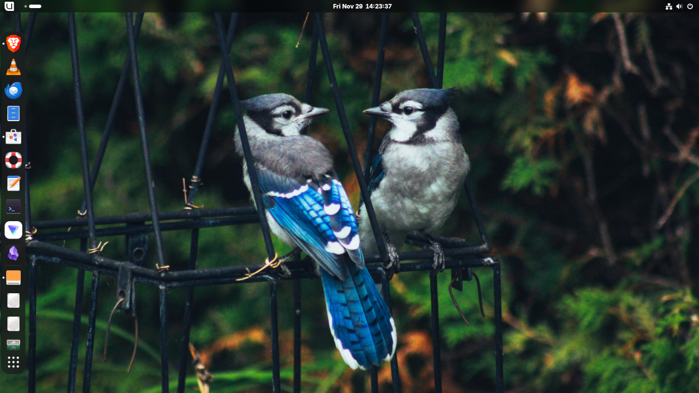

# Bluejay Linux is Bluefin and Aurora for Content Creation

## Bluejay



**Focuses: tools for editing media, writing code, crunching numbers, and doing analysis.**

(under construction)

## Bluefin - [projectbluefin.io](https://projectbluefin.io)


> "Evolution is a process of constant branching and expansion." - Stephen Jay Gould

For end users it provides a system as reliable as a Chromebook with near-zero maintainance. For developers, a powerful cloud native developer workflow. Check [Introduction to Bluefin](https://universal-blue.discourse.group/t/introduction-to-bluefin/41) for a feature walkthrough.

- [Download Bluefin](https://projectbluefin.io/#scene-picker)

## Documentation

1. [Discussions and Announcements](https://universal-blue.discourse.group/c/bluefin/6) - strongly recommended!
2. [Documentation](https://docs.projectbluefin.io/)
3. [Contributing Guide](https://docs.projectbluefin.io/contributing)

### Secure Boot

Secure Boot is supported by default on our systems, providing an additional layer of security. After the first installation, you will be prompted to enroll the secure boot key in the BIOS.

Enter the password `universalblue`
when prompted to enroll our key.

If this step is not completed during the initial setup, you can manually enroll the key by running the following command in the terminal:

`
ujust enroll-secure-boot-key
`

Secure boot is supported with our custom key. The pub key can be found in the root of the akmods repository [here](https://github.com/ublue-os/akmods/raw/main/certs/public_key.der).
If you'd like to enroll this key prior to installation or rebase, download the key and run the following:

```bash
sudo mokutil --timeout -1
sudo mokutil --import public_key.der
```

### Install by Rebasing!

To rebase an existing Silverblue/Bluefin/Bazzite/Aurora installation to the latest Bluejay build: 

*(Important note: the supported tags are `latest` and `stable`)*

- First rebase to the desired image, to get the proper signing keys and policies installed:
  ```
  sudo bootc switch ghcr.io/AB9IL/bluejay:latest
  ```
- If rebasing from a system not yet with bootc, use rpm-ostree:
  ```
  rpm-ostree cleanup -bm
  rpm-ostree rebase ostree-image-signed:docker://ghcr.io/AB9IL/bluejay:latest
  ```
  
- Reboot to complete the rebase:
  ```
  systemctl reboot
  ```
- Reboot again to complete the installation
  ```
  systemctl reboot
  ```
  
